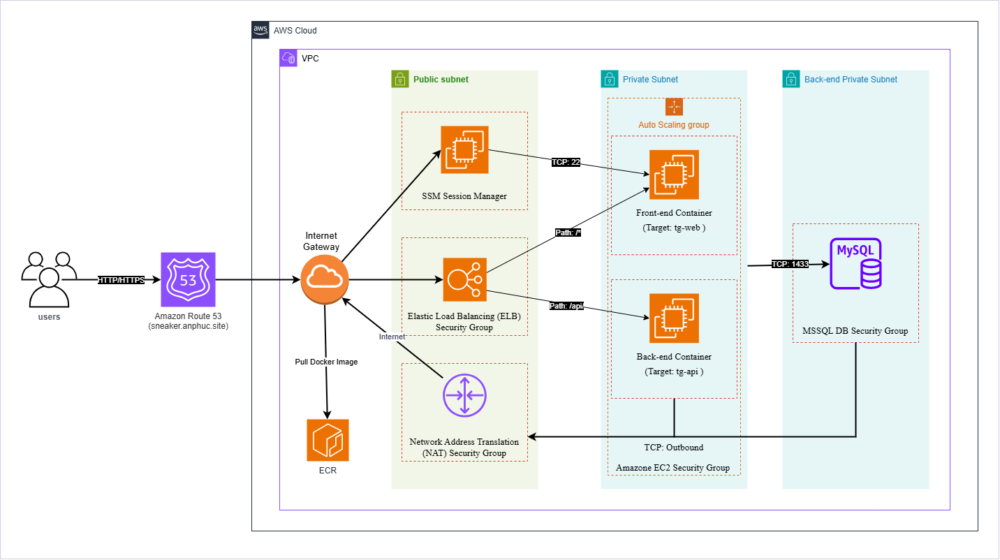
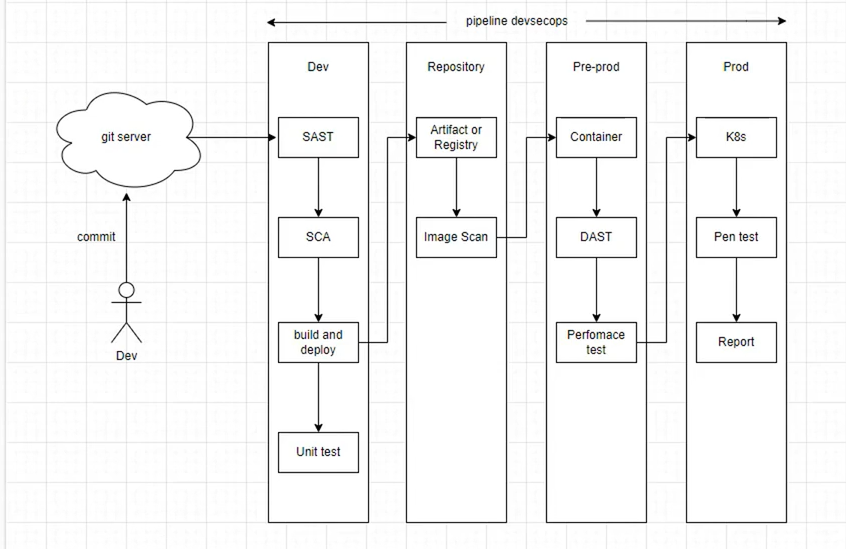
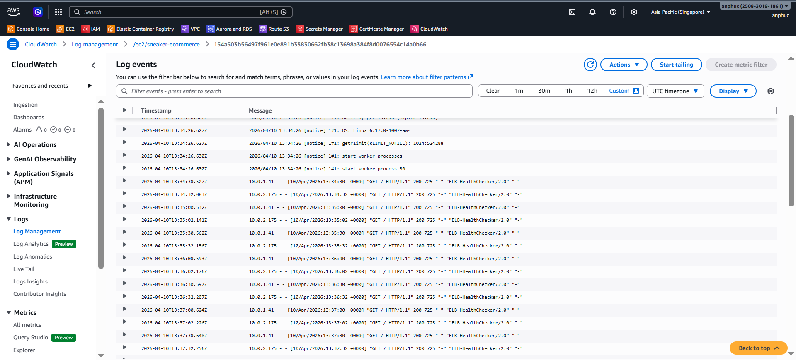
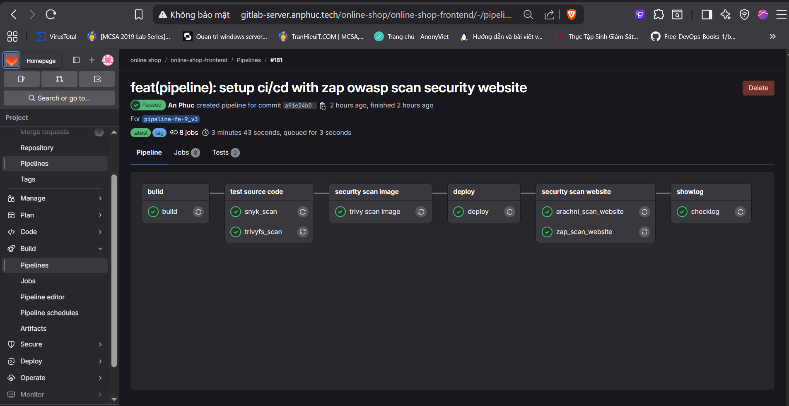
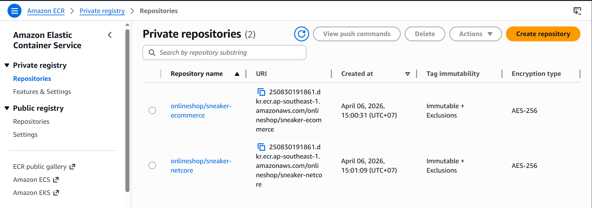
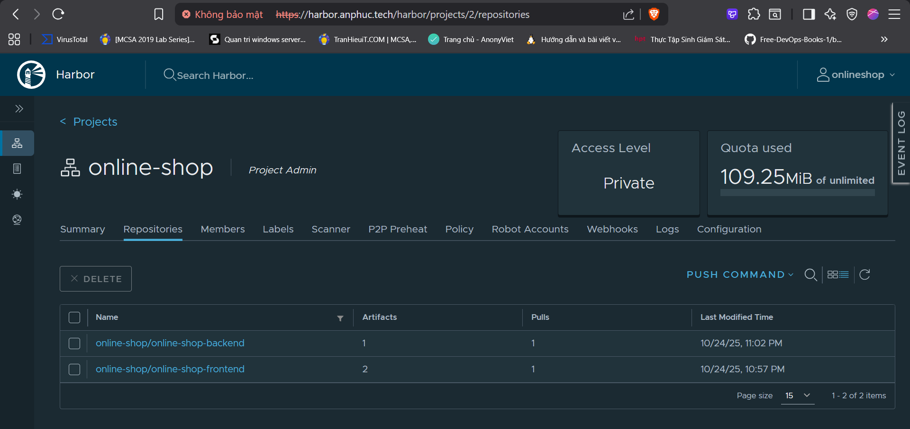
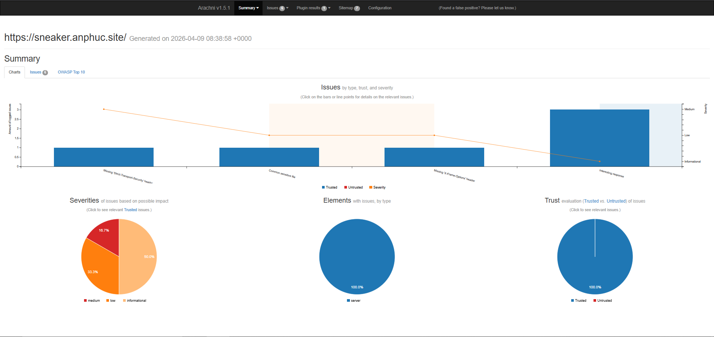
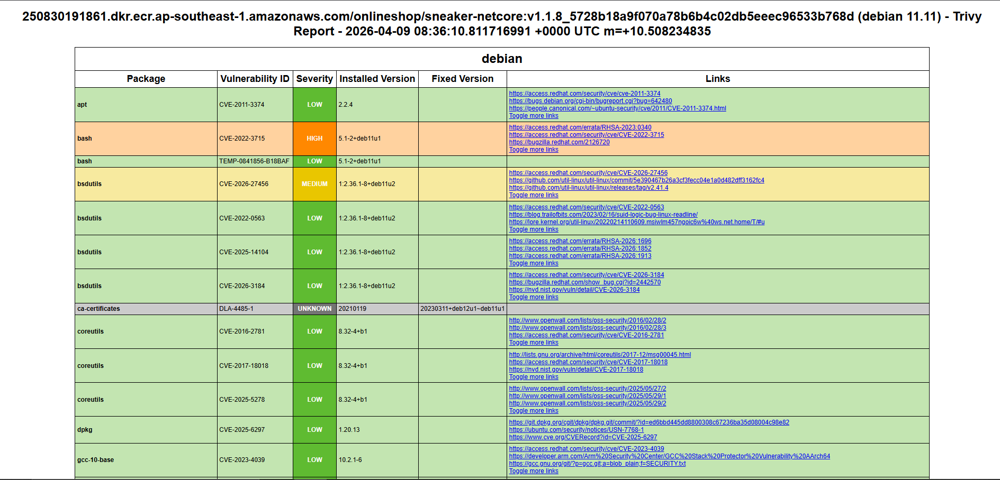
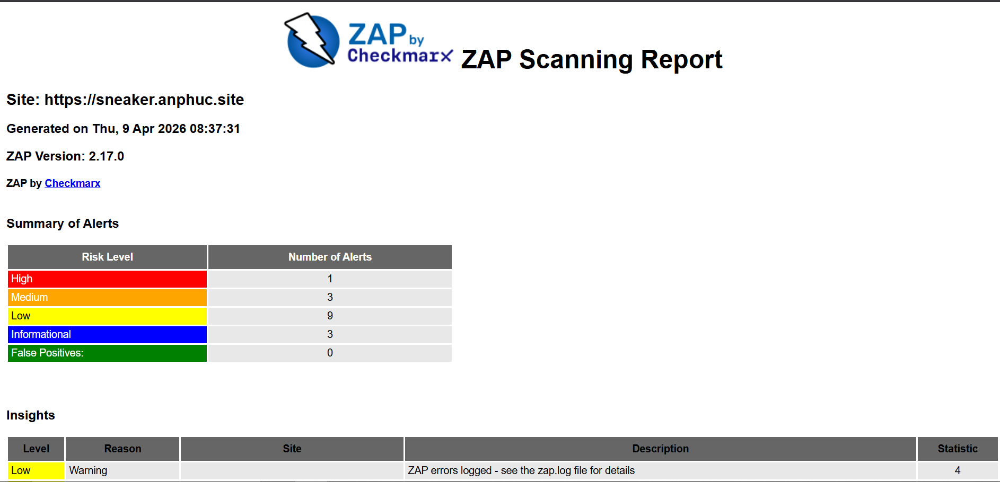

# E-Commerce Platform (Sneaker): AWS Infrastructure & DevSecOps Pipeline

Dự án triển khai hệ thống Web Application (E-Commerce) trên môi trường AWS, áp dụng kiến trúc Microservices. Trọng tâm của dự án là việc tự động hóa toàn bộ quy trình tích hợp và triển khai liên tục (CI/CD) kết hợp với các tiêu chuẩn bảo mật khắt khe (DevSecOps) để đảm bảo hệ thống vận hành an toàn, tính sẵn sàng cao và không gián đoạn (Zero-Downtime).

<strong>Table of Contents (Mục lục)</strong>

- [E-Commerce Platform (Sneaker): AWS Infrastructure \& DevSecOps Pipeline](#e-commerce-platform-sneaker-aws-infrastructure--devsecops-pipeline)
  - [1. Kiến trúc Hệ thống (System Architecture)](#1-kiến-trúc-hệ-thống-system-architecture)
  - [2. Thiết lập Mạng \& Bảo mật (Network \& Security)](#2-thiết-lập-mạng--bảo-mật-network--security)
  - [3. Cấu trúc Repository \& Quản lý Build](#3-cấu-trúc-repository--quản-lý-build)
  - [4. Quy trình DevSecOps (CI/CD Pipeline)](#4-quy-trình-devsecops-cicd-pipeline)
    - [Giai đoạn 1: Continuous Integration (CI)](#giai-đoạn-1-continuous-integration-ci)
    - [Giai đoạn 2: Security Assessment (SAST \& Container Security)](#giai-đoạn-2-security-assessment-sast--container-security)
    - [Giai đoạn 3: Continuous Deployment (CD)](#giai-đoạn-3-continuous-deployment-cd)
    - [Giai đoạn 4: Dynamic Security Testing (DAST)](#giai-đoạn-4-dynamic-security-testing-dast)
  - [5. Giám sát \& Vận hành (Monitoring)](#5-giám-sát--vận-hành-monitoring)
  - [6. Công nghệ sử dụng (Tech Stack)](#6-công-nghệ-sử-dụng-tech-stack)
  - [7. Kết quả triển khai (Implementation Evidence)](#7-kết-quả-triển-khai-implementation-evidence)
    - [7.1. Tự động hóa luồng CI/CD (Pipeline Execution)](#71-tự-động-hóa-luồng-cicd-pipeline-execution)
    - [7.2. Cấu hình định tuyến và Bảo mật (Traffic Routing \& HTTPS)](#72-cấu-hình-định-tuyến-và-bảo-mật-traffic-routing--https)
    - [7.3. Quản lý và Lưu trữ Container Image (ECR \& Harbor)](#73-quản-lý-và-lưu-trữ-container-image-ecr--harbor)
    - [7.4. Báo cáo đánh giá bảo mật (Vulnerability Reports)](#74-báo-cáo-đánh-giá-bảo-mật-vulnerability-reports)
  - [8. Thông tin liên hệ (Contact Information)](#8-thông-tin-liên-hệ-contact-information)

---

## 1. Kiến trúc Hệ thống (System Architecture)

Hệ thống được thiết kế theo chuẩn Production trên AWS, tách biệt các thành phần để tối ưu hóa khả năng mở rộng:

* **Compute (Xử lý tính toán):** Ứng dụng (Frontend và Backend API) được đóng gói bằng Docker và triển khai trên các EC2 Instances. Các instances này được quản lý bởi **Auto Scaling Group (ASG)** (`auto-scaling-gr-lab`), cho phép tự động điều chỉnh số lượng server dựa trên lưu lượng thực tế.
* **Database (Lưu trữ dữ liệu):** Sử dụng **Amazon RDS** làm máy chủ cơ sở dữ liệu độc lập, tách biệt hoàn toàn khỏi tầng Compute để đảm bảo an toàn dữ liệu khi có sự cố ở cấp độ Server.
* **Load Balancing & Routing:** Sử dụng **Application Load Balancer (ALB)** kết hợp với **Route 53**. ALB đóng vai trò là điểm vào duy nhất (Single Point of Entry), thực hiện Path-based routing: chuyển tiếp traffic mặc định vào Frontend và các request có tiền tố `/api/*` vào Backend.

  

## 2. Thiết lập Mạng & Bảo mật (Network & Security)

Kiến trúc mạng được thiết lập chặt chẽ theo nguyên tắc Đặc quyền tối thiểu (Principle of Least Privilege):

* **Security Groups (Tường lửa lớp Instance):**
    * **ALB Security Group:** Chỉ mở Port 443 (HTTPS) và Port 80 (HTTP) cho Internet (`0.0.0.0/0`). Cổng 80 được cấu hình Force Redirect sang 443 ở cấp độ Load Balancer.
    * **EC2/ASG Security Group:** Khóa hoàn toàn với Internet. Chỉ cho phép Inbound traffic (Port 80/Custom Ports) xuất phát từ **ALB Security Group**. Điều này ngăn chặn mọi nỗ lực truy cập trực tiếp vào server hoặc dò quét cổng (Port Scanning) từ bên ngoài.
    * **RDS Security Group:** Chỉ chấp nhận kết nối từ **EC2/ASG Security Group**, cô lập hoàn toàn database khỏi mạng công cộng.
* **SSL/TLS Encryption:** Chứng chỉ bảo mật được cấp phát và quản lý tự động qua **AWS Certificate Manager (ACM)**, mã hóa toàn bộ dữ liệu truyền tải giữa Client và ALB.

## 3. Cấu trúc Repository & Quản lý Build

Mã nguồn được lưu trữ trên GitHub và luồng Build được liên kết trực tiếp với **Amazon ECR (Elastic Container Registry)**.

**Quản lý Docker Image:**
* Mỗi khi có một Release mới (được đánh tag `v*`), Pipeline sẽ tự động trigger.
* Dự án sử dụng cơ chế Multi-tagging: Image được build và push lên ECR với 2 tag đồng thời:
    * Tag phiên bản chính xác: `${ECR_REGISTRY}/${REPO_NAME}:${REF_NAME}_${GITHUB_SHA}` (đảm bảo tính truy vết - traceability).
    * Tag `latest`: `${ECR_REGISTRY}/${REPO_NAME}:latest` (phục vụ cho các môi trường test nhanh).

**Các biến môi trường bảo mật (GitHub Secrets):**
Hệ thống sử dụng GitHub Secrets để không lộ thông tin nhạy cảm trong mã nguồn:
* `AWS_ACCESS_KEY_ID` / `AWS_SECRET_ACCESS_KEY`: Ủy quyền tương tác với AWS (ECR, ASG, CLI).
* `SNYK_TOKEN`: API Token cho trình quét bảo mật mã nguồn.
* `URL_BE`: Endpoint để thực hiện quét DAST sau khi deploy.

## 4. Quy trình DevSecOps (CI/CD Pipeline)

Pipeline được định nghĩa bằng GitHub Actions, chia làm nhiều Job chạy tuần tự và song song, tích hợp kiểm thử bảo mật ở mọi giai đoạn (Shift-Left Security).

  
   
  Mô hình hóa quy trình DevSecOps

### Giai đoạn 1: Continuous Integration (CI)
* **Build & Push:** Checkout mã nguồn, xác thực IAM Role với AWS, build Docker Image từ Dockerfile và push lên Amazon ECR.

### Giai đoạn 2: Security Assessment (SAST & Container Security)
Các Job này chạy ngầm định ngay sau khi Build hoàn tất:
* **Snyk Source Code Scan:** Phân tích mã nguồn và các thư viện phụ thuộc (dependencies) để tìm kiếm lỗ hổng đã biết (CVEs). Báo cáo được xuất ra định dạng HTML.
* **Trivy Filesystem Scan:** Quét cấu trúc thư mục của repository để phát hiện các cấu hình sai hoặc hard-coded secrets (chỉ cảnh báo mức HIGH và CRITICAL).
* **Trivy Image Scan:** Kéo (Pull) Image vừa tạo từ ECR về runner và quét sâu vào các layer của Docker Container để phát hiện lỗ hổng hệ điều hành.

### Giai đoạn 3: Continuous Deployment (CD)
* **Zero-Downtime Deployment:** Thay vì can thiệp thủ công vào EC2, Pipeline kích hoạt lệnh `aws autoscaling start-instance-refresh`.
* ASG sẽ thực hiện chiến lược Rolling Update (tự động thay thế dần các instance cũ bằng instance mới mang cấu hình/image mới nhất).
* Tham số `MinHealthyPercentage: 50` đảm bảo luôn có ít nhất 50% số lượng server hoạt động phục vụ người dùng trong suốt quá trình triển khai.

### Giai đoạn 4: Dynamic Security Testing (DAST)
Sau khi ứng dụng đã live trên môi trường Production, hệ thống tự động khởi chạy các cuộc tấn công mô phỏng:
* **Arachni Scan:** Quét toàn diện website và các subdomains (XSS, SQLi,...).
* **ZAP Baseline Scan:** Chạy OWASP ZAP dạng headless container để đánh giá các rủi ro bảo mật cơ bản theo chuẩn OWASP.

## 5. Giám sát & Vận hành (Monitoring)

* **Container Logs:** Tích hợp AWS CloudWatch Logs thông qua Docker Logging Driver. Toàn bộ standard output/error từ các container được đẩy tập trung về Log Group `/ec2/${REPO_NAME}`, giúp việc debug và truy vết lỗi dễ dàng mà không cần SSH trực tiếp vào server.
* **Health Checks:** sALB thực hiện kiểm tra sức khỏe (Health Check) liên tục vào các Target Group. Nếu một EC2 instance không phản hồi chuẩn xác, ALB sẽ tự động ngắt traffic đến instance đó và ASG sẽ tiến hành khởi tạo instance mới để thay thế.

  
   

## 6. Công nghệ sử dụng (Tech Stack)

Hệ thống được xây dựng trên nền tảng đám mây AWS, tích hợp chặt chẽ các công cụ tự động hóa và kiểm thử bảo mật chuẩn công nghiệp:

* **Cloud Infrastructure (AWS):** Elastic Compute Cloud (EC2), Auto Scaling Group (ASG), Application Load Balancer (ALB), Route 53, Certificate Manager (ACM), Relational Database Service (RDS), CloudWatch.
* **Containerization:** Docker, Amazon Elastic Container Registry (ECR), Harbor.
* **CI/CD & Automation:** GitHub Actions, Gitlab CI, AWS CLI.
* **Security (DevSecOps):**
  * Snyk (Dependency Scanning).
  * Aqua Trivy (Filesystem & Container Security Scanning).
  * OWASP ZAP (Dynamic Application Security Testing).
  * Arachni (Web Application Security Scanner framework).
* **Application Layer:**  Node.js, .NET 6, Java.

---

## 7. Kết quả triển khai (Implementation Evidence)

Dưới đây là các minh chứng kỹ thuật trích xuất từ quá trình vận hành hệ thống trên môi trường thực tế:

* Xây dựng và triển khai dự án sử dụng [**Dockerfile**](./Dockerfile) 
* Phiên bản chạy trên **GitLab CI** using [**.gitlab-ci.yml**](./.gitlab-ci.yml)
* Phiên bản chạy trên:
**[GitHub Actions Pipeline](https://github.com/Bel7phegor/sneaker-netcore/actions/runs/24254176069)**

Đẩy lên trên: **[DockerHub: anphuc2370](https://hub.docker.com/r/anphuc2370/online-shop-frontend)**
### 7.1. Tự động hóa luồng CI/CD (Pipeline Execution)

  
   
  Triển khai pipeline CI/CD trên Github Action 

  
   
  Triển khai pipeline CI/CD trên Gitlab CI

**Mô tả kỹ thuật:** Luồng DevSecOps vận hành hoàn toàn tự động qua GitHub Actions. Các tiến trình từ đóng gói mã nguồn, quét bảo mật tĩnh (SAST), triển khai không gián đoạn (Zero-downtime Deployment) đến quét bảo mật động (DAST) đều được thực thi và xác thực thành công qua các Pipeline Jobs.

### 7.2. Cấu hình định tuyến và Bảo mật (Traffic Routing & HTTPS)

  
   
  Giao diện website với SSL

**Mô tả kỹ thuật:** Ứng dụng được phân phối an toàn qua AWS Application Load Balancer. Tên miền `sneaker.anphuc.site` được cấp phát chứng chỉ SSL/TLS thông qua AWS ACM, đảm bảo mã hóa dữ liệu truyền tải và áp dụng quy tắc ép buộc chuyển hướng (Force Redirect) toàn bộ traffic từ Port 80 (HTTP) sang Port 443 (HTTPS).

  
   
  Luồng cân bằng tải trên hệ thống

### 7.3. Quản lý và Lưu trữ Container Image (ECR & Harbor)

  
   
  Lưu trữ image với AWS ECR

  
   
  Lưu trữ image với Harbor registry

**Mô tả kỹ thuật:** Hệ thống áp dụng chiến lược lưu trữ Container Image đa kho (Multi-registry Strategy) nhằm tối ưu hóa luồng CI/CD, tăng cường bảo mật và kiểm soát vòng đời của Image

### 7.4. Báo cáo đánh giá bảo mật (Vulnerability Reports)

  
  
  

**Mô tả kỹ thuật:** Hệ thống trích xuất báo cáo định dạng HTML tự động từ các công cụ đánh giá SAST/DAST (Aqua Trivy, Snyk, ZAP). Các lỗ hổng phát hiện được phân loại chi tiết theo mức độ rủi ro (Low, Medium, High, Critical), đóng vai trò là chốt kiểm soát chất lượng (Quality Gate) cho vòng đời phát triển phần mềm.

Tất cả báo cáo được tạo ra trong quá trình chạy pipeline và lưu trữ dưới dạng **HTML** dễ đọc và tải về.

* **SAST:** [Snyk Report](./Artifacts/snyk-scan-report.zip)
* **SCA:** [Trivy Report](./Artifacts/trivy-fs-report.zip)
* **Image Scan:** [Trivy Docker Image Report](./Artifacts/trivy-image-report.zip)
* **DAST:** [OWASP ZAP Report](./Artifacts/zap-website-report.zip) / [Arachni Report](./Artifacts/arachni-website-report.zip)

## 8. Thông tin liên hệ (Contact Information)

**Author:** Nguyễn An Phúc (@Bel7phegor)
* **Profiles:** [LinkedIn: nguyen-an-phuc](https://www.linkedin.com/in/nguyen-an-phuc) | [GitHub: Bel7phegor](https://github.com/Bel7phegor) | [Portfolio: anphuc.site](https://anphuc.site)
* **Email:** [nguyenanphuc12032002@gmail.com](mailto:nguyenanphuc12032002@gmail.com)